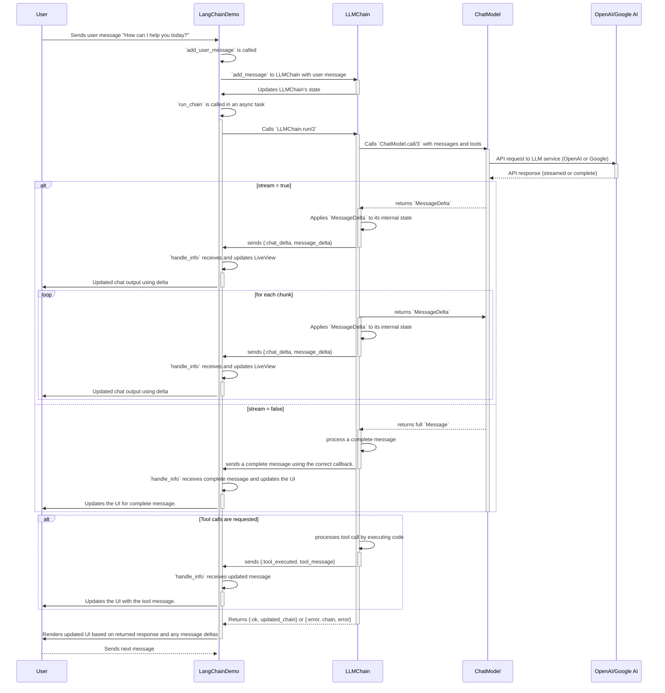

#  Elixir LangChain Demo App

This project is a demonstration example using the [Elixir LangChain](https://github.com/brainlid/langchain) library and [Phoenix LiveView](https://www.phoenixframework.org/).

To start your LangChain Demo project:

  * Run `mix setup` to install and setup dependencies
  * Setup your `export OPENAI_API_KEY=`, you can find more [here](https://platform.openai.com/docs/quickstart/step-2-setup-your-api-key)
  * Start Phoenix endpoint with `mix phx.server` or inside IEx with `iex -S mix phx.server`

Now you can visit [`localhost:4400`](http://localhost:4400) from your browser.

## Conversations

Visit the [Conversations](http://localhost:4004/conversations) page for having a conversation with ChatGPT.

You can cancel a request in flight, delete a message, edit a message, and resubmit the conversation.

Features:
- Conversations are written to a SQLite database in the project directory.
- Conversations are performed using the [Elixir LangChain](https://github.com/brainlid/langchain) library.
- Uses Phoenix LiveView [Async Operations](https://hexdocs.pm/phoenix_live_view/Phoenix.LiveView.html#module-async-operations).
- Use <kbd>ctrl+enter</kbd> to submit a message.

## Personal Fitness AI Agent

An [Agent](https://python.langchain.com/docs/modules/agents/) can be described as:

> **Agent**: a language model is used as a reasoning engine to determine which actions to take and in which order.

Visit the [Personal Fitness Trainer](http://localhost:4004/agent_chat) page to meet with your own Personal AI Fitness Trainer.

Suggestion: Ask "how do we start?" to get started and go from there!

For an overview and to see it in action, check out the video:

There is a companion [blog post about it](https://fly.io/phoenix-files/created-my-personal-ai-fitness-trainer-in-2-days/) as well that gives an overview of how it works.

You can create a weekly workout plan to help you reach your goals. Information about you is stored in a local SQLite database. Report on your workouts to your assistant and they will log them for you. The assistant can access your stored information and historical workout logs to answer questions and help you on your personal fitness journey! 💪

Features:
- Context around how the AI is configured is hidden from the user.
- Data about the user is written in a structured format by the AI into a local SQLite database.
- Historical fitness log entries are stored and fetched from the local database.
- Provides a simple but powerful working example of how to create an AI assistant in Elixir that integrates with your app.

## Diagram

**Explanation of the Diagram**

*   **Participants:**
    *   `User`: The person interacting with the application through the browser.
    *   `LangChainDemo`: Your application's code, specifically the LiveView.
    *   `LLMChain`: The `LangChain.Chains.LLMChain` which manages the conversation.
    *   `ChatModel`:  The `LangChain.ChatModels` modules (like `ChatOpenAI` or `ChatGoogleAI`) that interact with the LLM service.
    *   `OpenAI/Google AI`:  The external LLM API that does the actual generation (OpenAI or Google's Gemini).
*   **Flow:**
    1.  **User Input:** The user sends a message to `LangChainDemo`.
    2.  **Message Handling:**
        *   `LangChainDemo` processes the message, and adds the message to the `LLMChain`.
        *   `LLMChain` updates it's internal state.
        *   `LangChainDemo` kicks off an async task that calls `LLMChain.run/2` on the chain.
    3.  **LLM Interaction:**
        *   `LLMChain` calls `ChatModel.call/3`, passing in the current conversation and any functions (tools) that are available.
        *   `ChatModel` sends the request to the configured LLM (OpenAI or Google) service.
    4. **API Response:**
        * When `stream` is `true`, the LLM service returns `MessageDelta`s.
        *   When `stream` is `false`, the LLM service returns a single `Message`.
    5. **Message Processing (If Streaming)**
       *  `ChatModel` returns the streamed `MessageDelta` back to `LLMChain`.
       * `LLMChain` updates its internal state with the `MessageDelta`.
       * `LLMChain` sends the `MessageDelta` to the `LangChainDemo` LiveView.
        *`LangChainDemo` uses the callback information to update the UI
    6. **Tool Calls:** If an assistant message requests a tool call:
        *   `LLMChain` processes the tool call by executing your provided code.
         *   `LLMChain` sends the new `ToolResult` message back to the  `LangChainDemo` LiveView.
        *   `LangChainDemo` uses the callback to update the UI with the tool result information.
   7. **Complete Message:** Once all messages have been processed:
    *   `LLMChain` returns `{:ok, updated_chain}` or `{:error, chain, error}` back to the  `LangChainDemo` LiveView.
   8. **UI Update:** `LangChainDemo` receives this result and renders the updated UI with the LLM's response.
   9.  **User Interaction Continues:** The user can then send the next message, and the cycle repeats.
